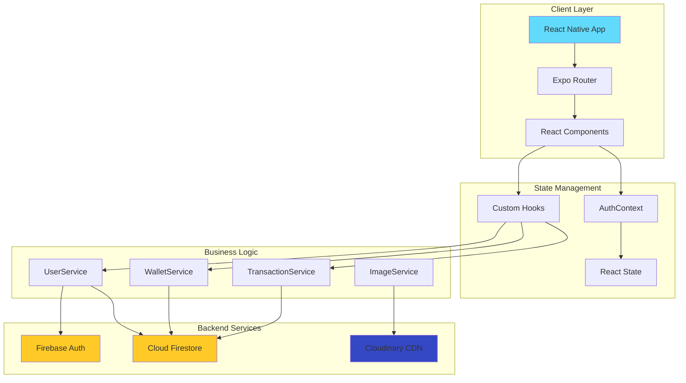
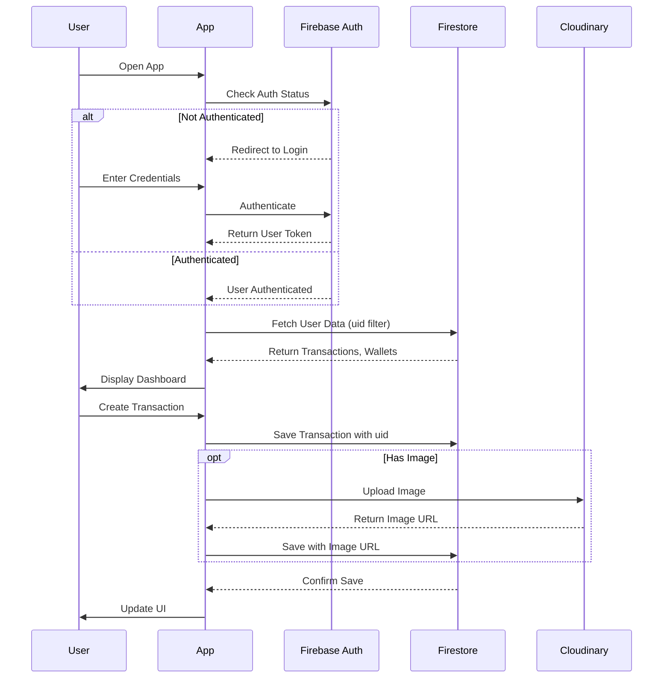
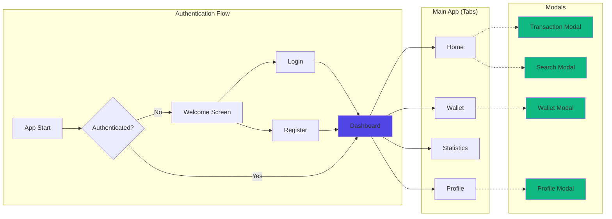
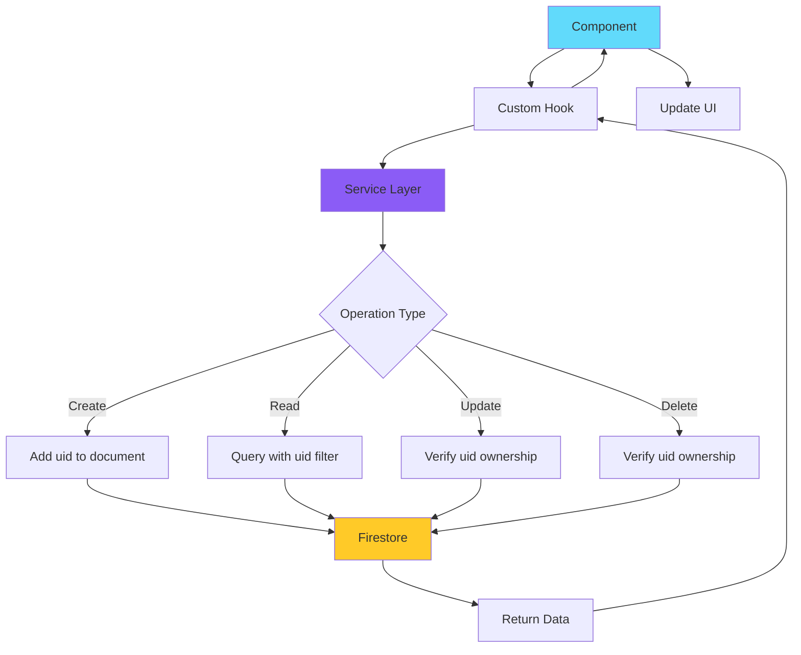
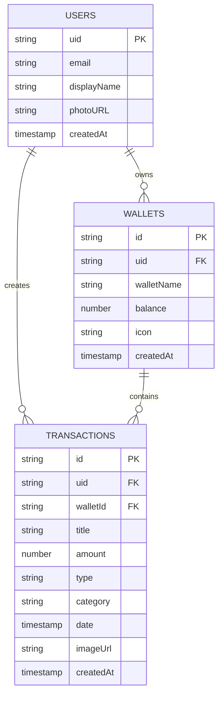

# 💰 FinTrack - Personal Finance Tracker

<div align="center">


[](https://choosealicense.com/licenses/mit/)
[](https://reactnative.dev/)
[](https://expo.dev/)
[](https://www.typescriptlang.org/)
[](https://firebase.google.com/)

**A modern, cross-platform mobile application for effortless personal finance management**

[Features](#-features)  • [Installation](#-installation) • [Architecture](#-architecture) • [Tech Stack](#-tech-stack) • [Contributing](#-contributing)

</div>

---

## 📋 Table of Contents

- [Overview](#-overview)
- [Features](#-features)
- [Screenshots](#-screenshots)
- [Architecture](#-architecture)
- [Tech Stack](#-tech-stack)
- [Project Structure](#-project-structure)
- [Installation](#-installation)
- [Configuration](#-configuration)
- [Usage](#-usage)
- [API Documentation](#-api-documentation)
- [Database Schema](#-database-schema)
---

## 🎯 Overview

**FinTrack** is a comprehensive personal finance management application built with React Native and Expo. It empowers users to take control of their financial life through intuitive transaction tracking, multi-wallet organization, visual analytics, and secure cloud synchronization.

### Why FinTrack?

- 📱 **Cross-Platform**: Single codebase for iOS, Android, and Web
- 🔐 **Secure**: Firebase Authentication with encrypted data storage
- 📊 **Visual Analytics**: Beautiful charts to understand spending patterns
- 💼 **Multi-Wallet**: Organize finances across multiple accounts
- 🎨 **Modern UI**: Clean, intuitive interface with smooth animations
- ☁️ **Cloud Sync**: Access your data from any device
- 🚀 **Performance**: Built with React Native's New Architecture

---

## ✨ Features

### 🔑 Authentication System
- Secure user registration and login via Firebase
- Email/password authentication
- Session persistence across app launches
- Protected routes with authentication guards
- Secure logout functionality

### 💳 Transaction Management
- ➕ Create income and expense transactions
- 📝 Categorize transactions (Food, Transport, Entertainment, etc.)
- 🖼️ Attach images to transactions via Cloudinary
- ✏️ Edit and delete existing transactions
- 🔍 Search and filter transactions
- 📅 Date-based transaction organization

### 👛 Wallet Organization
- 🏦 Create and manage multiple wallets
- 💰 Real-time balance tracking
- 🎨 Custom wallet names and icons
- 📊 Per-wallet transaction history
- ✏️ Edit wallet details
- 🔄 Transfer between wallets

### 📈 Statistics & Analytics
- 📊 Interactive pie charts for expense breakdown
- 📉 Line charts for spending trends
- 📅 Time-period segmentation (Week/Month/Year)
- 💡 Category-wise spending insights
- 📊 Income vs Expense comparison
- 🎯 Visual spending patterns

### 👤 Profile Management
- 📸 Profile picture upload to Cloudinary CDN
- ✏️ Edit user information
- ⚙️ Account settings
- 🔐 Change password
- 🚪 Secure logout


---

## 📸 Screenshots

<div align="center">

| Welcome Screen | Login | Dashboard |
|:---:|:---:|:---:|
| 
 |
 |
|

| Wallet | Statistics | Profile |
|:---:|:---:|:---:|
| 
| 
|
|

</div>

---

## 🏗️ Architecture

### High-Level Architecture Diagram



### Application Flow



### Navigation Architecture



### Data Flow Pattern



---

## 🛠️ Tech Stack

### Frontend

| Technology | Version | Purpose |
|------------|---------|---------|
| **React Native** | 0.76.5 | Cross-platform mobile framework |
| **Expo SDK** | 52 | Development toolchain and runtime |
| **TypeScript** | 5.3.3 | Type-safe development |
| **Expo Router** | Latest | File-based routing system |
| **React Native Reanimated** | Latest | High-performance animations |
| **Phosphor Icons** | Latest | Beautiful icon library |
| **React Native Gifted Charts** | Latest | Data visualization |

### Backend & Services

| Technology | Purpose |
|------------|---------|
| **Firebase Authentication** | User authentication and session management |
| **Cloud Firestore** | NoSQL database for real-time data |
| **Cloudinary** | Image upload and CDN service |

### Development Tools

| Tool | Purpose |
|------|---------|
| **Expo Application Services** | Cloud build and deployment |
| **Git** | Version control |
| **ESLint** | Code linting |
| **Prettier** | Code formatting |

---

## 📁 Project Structure

```
FinTrack/
├── 📱 app/                          # Application routes (expo-router)
│   ├── 🔐 (auth)/                   # Authentication flow
│   │   ├── welcome.tsx              # Welcome/splash screen
│   │   ├── login.tsx                # Login screen
│   │   └── register.tsx             # Registration screen
│   │
│   ├── 📑 (tabs)/                   # Main app tabs
│   │   ├── _layout.tsx              # Tab layout with custom tab bar
│   │   ├── index.tsx                # Home/Dashboard screen
│   │   ├── wallet.tsx               # Wallet management screen
│   │   ├── statistics.tsx           # Analytics screen
│   │   └── profile.tsx              # User profile screen
│   │
│   ├── 🔲 (models)/                 # Modal overlays
│   │   ├── TransactionModal.tsx     # Create/edit transaction
│   │   ├── WalletModal.tsx          # Create/edit wallet
│   │   ├── ProfileModal.tsx         # Edit profile
│   │   └── SearchModal.tsx          # Search transactions
│   │
│   ├── _layout.tsx                  # Root layout with AuthProvider
│   └── index.tsx                    # App entry point
│
├── 🧩 components/                   # Reusable UI components
│   ├── Button.tsx                   # Custom button component
│   ├── Input.tsx                    # Custom input component
│   ├── Typo.tsx                     # Typography component
│   ├── CustomsTab.tsx               # Custom tab bar
│   └── ...
│
├── 🔧 services/                     # Business logic layer
│   ├── TransactionService.ts        # Transaction CRUD operations
│   ├── WalletService.ts             # Wallet CRUD operations
│   ├── UserServices.ts              # User profile operations
│   └── ImageService.ts              # Cloudinary image upload
│
├── 🎣 hooks/                        # Custom React hooks
│   └── useFetchData.ts              # Generic Firestore data fetching
│
├── 🌍 context/                      # React Context providers
│   └── authcontext.tsx              # Authentication state management
│
├── 🎨 constants/                    # Theme and configuration
│   └── theme.tsx                    # Color palette, typography
│
├── 📘 types/                        # TypeScript type definitions
│   └── index.ts                     # Shared types (User, Transaction, Wallet)
│
├── 🛠️ utils/                        # Utility functions
│   └── styling.ts                   # Style helpers
│
├── 🖼️ assets/                       # Static assets
│   ├── images/                      # Image files
│   └── fonts/                       # Custom fonts
│
├── 📄 app.json                      # Expo configuration
├── 📦 package.json                  # Dependencies
├── 🔧 tsconfig.json                 # TypeScript configuration
├── 📝 README.md                     # This file
└── 📜 LICENSE                       # MIT License
```

---

## 🚀 Installation

### Prerequisites

Before you begin, ensure you have the following installed:

- **Node.js** (v18 or higher)
- **npm** or **yarn**
- **Git**
- **Expo CLI** (optional, but recommended)
- **iOS Simulator** (for Mac users) or **Android Studio** (for Android development)

### Step 1: Clone the Repository

```bash
git clone https://github.com/asifrazadev/FinTrack.git
cd FinTrack
```

### Step 2: Install Dependencies

```bash
npm install
# or
yarn install
```

### Step 3: Configure Environment Variables

Create a `.env` file in the root directory:

```env
# Firebase Configuration
EXPO_PUBLIC_FIREBASE_API_KEY=your_firebase_api_key
EXPO_PUBLIC_FIREBASE_AUTH_DOMAIN=your_project.firebaseapp.com
EXPO_PUBLIC_FIREBASE_PROJECT_ID=your_project_id
EXPO_PUBLIC_FIREBASE_STORAGE_BUCKET=your_project.appspot.com
EXPO_PUBLIC_FIREBASE_MESSAGING_SENDER_ID=your_sender_id
EXPO_PUBLIC_FIREBASE_APP_ID=your_app_id

# Cloudinary Configuration
EXPO_PUBLIC_CLOUDINARY_CLOUD_NAME=your_cloud_name
EXPO_PUBLIC_CLOUDINARY_UPLOAD_PRESET=your_upload_preset
```

### Step 4: Start Development Server

```bash
npx expo start
```

**Options:**
- Press `i` - Open iOS simulator
- Press `a` - Open Android emulator
- Press `w` - Open in web browser
- Scan QR code with Expo Go app (iOS/Android)

---

## ⚙️ Configuration

### Firebase Setup

1. **Create Firebase Project**
   - Go to [Firebase Console](https://console.firebase.google.com/)
   - Click "Add Project"
   - Follow the setup wizard

2. **Enable Authentication**
   - Navigate to Authentication → Sign-in method
   - Enable "Email/Password" provider

3. **Create Firestore Database**
   - Navigate to Firestore Database
   - Click "Create database"
   - Start in **test mode** (we'll secure it next)

4. **Configure Security Rules**

```javascript
rules_version = '2';
service cloud.firestore {
  match /databases/{database}/documents {
    
    // Transactions - users can only access their own
    match /transactions/{transactionId} {
      allow read: if request.auth != null 
                  && resource.data.uid == request.auth.uid;
      allow create: if request.auth != null 
                    && request.resource.data.uid == request.auth.uid;
      allow update, delete: if request.auth != null 
                            && resource.data.uid == request.auth.uid;
    }
    
    // Wallets - users can only access their own
    match /wallets/{walletId} {
      allow read: if request.auth != null 
                  && resource.data.uid == request.auth.uid;
      allow create: if request.auth != null 
                    && request.resource.data.uid == request.auth.uid;
      allow update, delete: if request.auth != null 
                            && resource.data.uid == request.auth.uid;
    }
    
    // Users - users can only read/write their own profile
    match /users/{userId} {
      allow read, write: if request.auth != null 
                         && request.auth.uid == userId;
    }
  }
}
```

5. **Get Firebase Config**
   - Project Settings → General → Your apps
   - Copy configuration values to `.env`

### Cloudinary Setup

1. **Create Cloudinary Account**
   - Sign up at [Cloudinary](https://cloudinary.com/)

2. **Create Upload Preset**
   - Settings → Upload → Upload presets
   - Click "Add upload preset"
   - Set **Signing Mode** to "Unsigned"
   - Copy preset name to `.env`

3. **Get Cloud Name**
   - Dashboard → Account Details
   - Copy "Cloud name" to `.env`

---

## 📖 Usage

### Running the App

**Development Mode:**
```bash
npx expo start
```

**Production Build:**
```bash
# iOS
eas build --platform ios

# Android
eas build --platform android

# All platforms
eas build --platform all
```

### Common Commands

```bash
# Install dependencies
npm install

# Start development server
npm start

# Start with cache cleared
npm start -- --clear

# Run on specific platform
npm run ios
npm run android
npm run web

# Run tests
npm test

# Lint code
npm run lint

# Type check
npm run type-check

# Reset project (removes example code)
npm run reset-project
```

---

## 📚 API Documentation

### TransactionService

#### `createTransaction(transaction: Transaction): Promise<string>`
Creates a new transaction in Firestore.

**Parameters:**
```typescript
{
  uid: string;           // User ID (from Firebase Auth)
  title: string;         // Transaction description
  amount: number;        // Transaction amount
  type: 'income' | 'expense';
  category: string;      // Category name
  walletId: string;      // Associated wallet ID
  date: Timestamp;       // Transaction date
  imageUrl?: string;     // Optional image URL
}
```

**Returns:** Document ID

---

#### `fetchTransactions(uid: string): Promise<Transaction[]>`
Fetches all transactions for a specific user.

**Returns:** Array of transactions sorted by date (descending)

---

#### `updateTransaction(id: string, updates: Partial<Transaction>): Promise<void>`
Updates an existing transaction.

---

#### `deleteTransaction(id: string): Promise<void>`
Deletes a transaction by ID.

---

### WalletService

#### `createWallet(wallet: Wallet): Promise<string>`
Creates a new wallet.

**Parameters:**
```typescript
{
  uid: string;           // User ID
  walletName: string;    // Wallet display name
  balance: number;       // Initial balance
  icon?: string;         // Optional icon identifier
}
```

---

#### `fetchWallets(uid: string): Promise<Wallet[]>`
Fetches all wallets for a user.

---

#### `updateWallet(id: string, updates: Partial<Wallet>): Promise<void>`
Updates wallet details.

---

#### `deleteWallet(id: string): Promise<void>`
Deletes a wallet (note: should handle associated transactions).

---

### ImageService

#### `uploadImage(uri: string): Promise<string>`
Uploads an image to Cloudinary.

**Parameters:**
- `uri`: Local file URI from image picker

**Returns:** Cloudinary URL

---

## 🗄️ Database Schema

### Collections Structure



### Firestore Collections

#### `users/`
```json
{
  "uid": "firebase_auth_uid",
  "email": "user@example.com",
  "displayName": "John Doe",
  "photoURL": "https://cloudinary.com/...",
  "createdAt": "Timestamp"
}
```

#### `transactions/`
```json
{
  "id": "auto_generated_id",
  "uid": "firebase_auth_uid",
  "walletId": "wallet_id",
  "title": "Grocery Shopping",
  "amount": 45.50,
  "type": "expense",
  "category": "Food",
  "date": "Timestamp",
  "imageUrl": "https://cloudinary.com/...",
  "createdAt": "Timestamp"
}
```

#### `wallets/`
```json
{
  "id": "auto_generated_id",
  "uid": "firebase_auth_uid",
  "walletName": "Personal Savings",
  "balance": 1500.00,
  "icon": "wallet",
  "createdAt": "Timestamp"
}
```

---

## 👨‍💻 Contact

**Asif Raza**

- 🌐 Portfolio: [asif-raza-dev.vercel.app](https://asif-raza-dev.vercel.app/)
- 💼 LinkedIn: [linkedin.com/in/asifrazadev](https://linkedin.com/in/asifrazadev)
- 📧 Email: asifrazadev@gmail.com
- 🐙 GitHub: [@asifrazadev](https://github.com/asifrazadev)


## ⭐ Show Your Support

If you find this project helpful, please consider:

- ⭐ Starring the repository
- 🐛 Reporting bugs
- 💡 Suggesting new features
- 🔀 Contributing to the codebase
- 📢 Sharing with others

---

<div align="center">

**Made with ❤️ by Asif Raza**

[⬆ Back to Top](#-fintrack---personal-finance-tracker)

</div>
